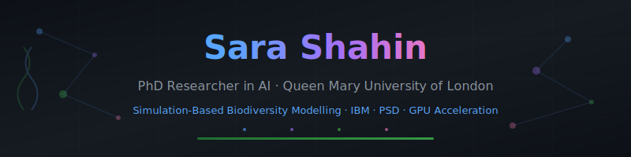

<div align="center">

<!-- Custom Header Banner -->


<br>

[](https://orcid.org/0009-0000-7847-6242)
[](https://www.linkedin.com/in/sara-shahin-ai/)
[](mailto:s.shahin@qmul.ac.uk)
[](https://www.kaggle.com/sarashahin)

</div>

---

## 👋 About Me

I'm a **PhD student at Queen Mary University of London** developing unified spatio-temporal biodiversity models that bridge **individual-based simulations (IBM)**, **ODE systems**, and **probabilistic-stochastic-deterministic (PSD) approximations**. My work combines rigorous mathematical modelling with modern deep learning to advance ecological forecasting and conservation science.

Beyond biodiversity, I deliver applied ML in **medical imaging** (robust segmentation under adversarial conditions) and **wildlife biometrics** (camera-trap re-identification).

<br>

## 🔬 Research Pipeline

<div align="center">

</div>

<br>

## 🎓 Education

| Degree | Institution | Period | Result |
|:-------|:------------|:-------|:------:|
| **PhD** Simulation-Based Unified Spatio-Temporal Biodiversity Modelling | Queen Mary University of London | 2025 – Present | — |
| **MSc** Artificial Intelligence | Anglia Ruskin University | 2023 – 2024 | **Distinction** |
| **BSc** Machine Learning & Artificial Intelligence | Goldsmiths, University of London | 2020 – 2023 | **First Class** |

<br>

## 🛠️ Technical Skills

<div align="center">

</div>

<br>

### Tech Stack

<div align="center">

**Languages & Frameworks**


**DevOps & Tools**


</div>

<br>

## 📂 Featured Projects

<table>
<tr>
<td width="50%" valign="top">

### 🧬 Metacommunity Simulator
**IBM / ODE / PSD Framework**

Multi-patch individual-based model with infinite-pool assembly, ODE and PSD baselines, dispersal kernels, and invasion tracking.

**Highlights:**
- GPU acceleration via **CuPy/CUDA**
- Stable time-stepping with diagnostic guards
- Mosaic & trajectory visualisation panels

**Key finding:** PSD replicates IBM/ODE qualitative dynamics across body-mass regimes.


</td>
<td width="50%" valign="top">

### 🦡 [Badger AI](https://github.com/sarashahin/Badger_AI)
**Wildlife Biometrics & Re-identification**

Self-supervised features + metric learning for camera-trap individual identification.

**Highlights:**
- Detectron2 / YOLOv5 detection baselines
- **>90%** same-individual retrieval accuracy
- Robust to varied lighting and angle
- Field-ready GUI


</td>
</tr>
<tr>
<td width="50%" valign="top">

### 🏥 [Medical Imaging](https://github.com/sarashahin/Breast_Cancer_UNet_Segmentatio)
**Attention-UNet & Adversarial Defenses**

Ultrasound segmentation with robustness testing under noise and adversarial perturbations.

**Results:**
- **+4–6% Dice** over vanilla UNet
- **+10% mAP** under corruption (ensemble defenses)
- Comprehensive perturbation analysis


</td>
<td width="50%" valign="top">

### 🎙️ [NART Grading](https://github.com/sarashahin/Automate-Grading-Test-NART)
**Speech Analysis for Clinical Assessment**

Automated grading of National Adult Reading Test pronunciations.

**Features:**
- Mel-spectrogram feature extraction
- CNN / CRNN / Transformer architectures
- Phoneme-level confusion analysis
- Cross-speaker generalisation


</td>
</tr>
<tr>
<td width="50%" valign="top">

### 📰 [Multimodal Fake News](https://github.com/sarashahin/Multimodal-Fake-News-Detection)
**Vision-Language Fusion**

CNN (image) + BERT (text) with late fusion classification.

**Results:**
- **+3–5% accuracy** vs unimodal baselines
- End-to-end trainable pipeline


</td>
<td width="50%" valign="top">

### 🔬 Additional Work

- Stochastic process simulation
- Ecological time-series analysis  
- GPU-accelerated numerical methods
- Robustness & adversarial ML

*Some repositories are private during active research.*

</td>
</tr>
</table>

<br>

## 📄 Publications

| Status | Title | Venue |
|:------:|:------|:------|
| 📝 | **Distinct Paradigms of Metacommunity Theory Emerge from Probabilistic–Stochastic–Deterministic Approximation of Individual-Based Models** | *In preparation for Nature* |
| ✅ | **Evaluation of Ensemble Learning for Mitigating Adversarial Attacks in Industrial Object Detection** | *TechRxiv* · [DOI](https://doi.org/10.36227/techrxiv.171561173.31420188/v1) |

<br>

## 🏆 Awards & Recognition

| | Award | Details |
|:--:|:------|:--------|
| 🏛️ | **Alan Turing Institute — Data Study Group** | Selected PhD researcher · Sept 2025 |
| 🌍 | **Open Source Summit Europe 2025** | Fully funded scholarship · Amsterdam |
| 🧬 | **Bertelsmann Scholarship** | Genomic Data Science Track |
| 👩‍💻 | **Women in Computer Science & Engineering** | Sponsored Delegate · Milan |

<br>

## 📊 GitHub Analytics

<div align="center">

<!-- Stats Card - using multiple providers for reliability -->
<a href="https://github.com/sarashahin">
  
</a>
<a href="https://github.com/sarashahin">
  
</a>

<br><br>

<!-- Streak Stats -->
<a href="https://github.com/sarashahin">
  
</a>

<br><br>

<!-- Activity Graph - using reliable provider -->
<a href="https://github.com/sarashahin">
  
</a>

</div>

<br>

> 💡 **Note:** Most of my active development happens in private repositories for ongoing PhD research. Public contributions don't reflect the full scope of my work.

<br>

## 🎯 Current Focus

```python
class CurrentResearch:
    """What I'm working on right now."""
    
    def __init__(self):
        self.institution = "Queen Mary University of London"
        self.phd_focus = "Unified spatio-temporal biodiversity modelling"
        self.methods = [
            "Individual-Based Models (IBM)",
            "PSD approximation framework",
            "GPU-accelerated simulation",
            "Bayesian uncertainty quantification"
        ]
        self.applications = [
            "Conservation science",
            "Species distribution prediction",
            "Ecological forecasting"
        ]
        self.open_to = [
            "Research collaborations",
            "Internships in AI + sustainability",
            "Open-source contributions"
        ]
    
    def contact(self) -> str:
        return "s.shahin@qmul.ac.uk"
```

<br>

---

<div align="center">

### 🤝 Let's Connect

I'm open to research collaborations and opportunities in **AI**, **simulation**, and **sustainability**.

<br>

[](mailto:s.shahin@qmul.ac.uk)
[](https://www.linkedin.com/in/sara-shahin-3a842929/)
[](https://github.com/sarashahin/Sara-Shahin/blob/main/Profile.pdf)

<br>


<br>

<sub>⭐ Star my repositories if you find them useful!</sub>

</div>
